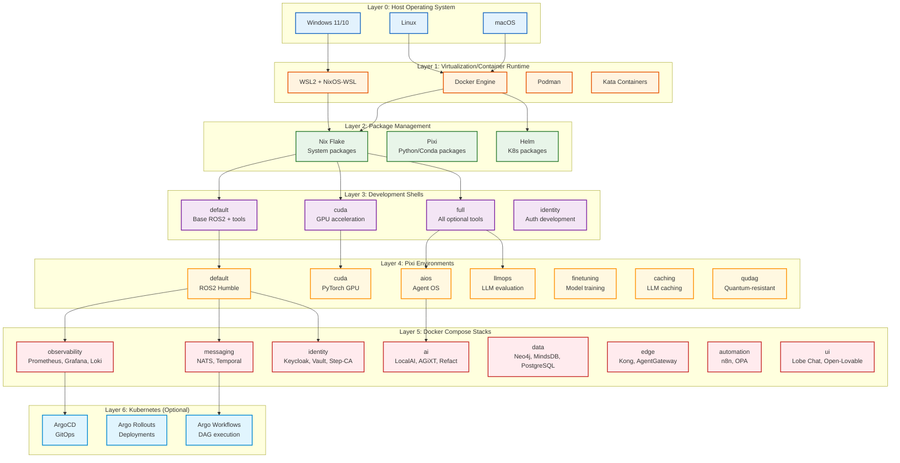
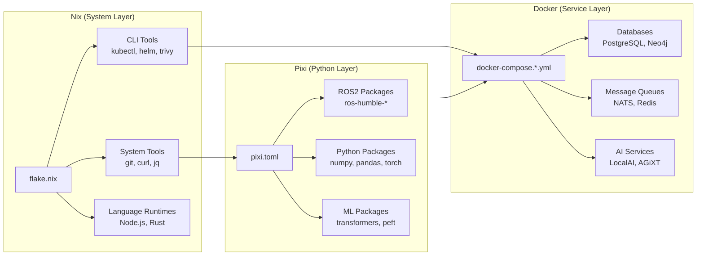
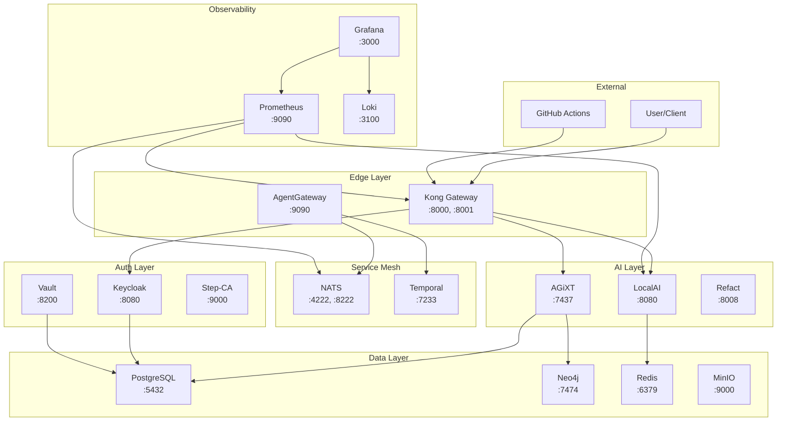
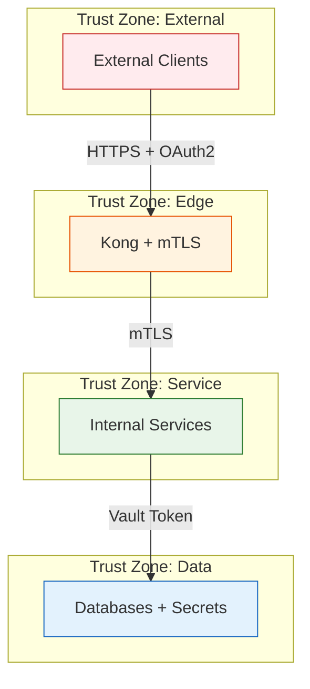

# Architecture Overview

**Status:** Phase 3 Complete (Environment Taxonomy + Layering)
**Last Updated:** 2026-01-14
**Evidence:** flake.nix, pixi.toml, docker-compose.*.yml, ARIA_MANIFEST.yaml

---

## Environment Layer Diagram

---

## Layer Descriptions

### Layer 0: Host Operating System

The foundation layer where the user runs their development environment.

| Platform | Bootstrap Script | Requirements |
|----------|-----------------|--------------|
| Windows 10/11 | `bootstrap.ps1` | Build 19041+, Admin rights, WSL2 capable |
| Linux (Ubuntu, Fedora, NixOS) | `bootstrap.sh` | systemd or equivalent, curl |
| macOS (Intel/ARM) | `bootstrap.sh` | Xcode CLI tools |

**Evidence:** `bootstrap.sh` lines 471-547 (detect_system), `bootstrap.ps1` lines 260-275

### Layer 1: Virtualization/Container Runtime

Container and VM runtimes that host services.

| Runtime | Purpose | Configuration |
|---------|---------|---------------|
| WSL2 | Windows Linux subsystem | `.wslconfig` for memory/swap |
| Docker Engine | Container runtime | `daemon.json` for storage/cgroups |
| Podman | Rootless containers | Alternative to Docker |
| Kata Containers | Sandboxed execution | For agent isolation |

**Evidence:** `bootstrap.ps1` lines 311-488, `docker/` directory

### Layer 2: Package Management

Three complementary package managers with different scopes.

| Manager | Scope | Lock File | Configuration |
|---------|-------|-----------|---------------|
| Nix | System packages, shells | `flake.lock` | `flake.nix` |
| Pixi | Python/Conda packages | `pixi.lock` | `pixi.toml` |
| Helm | Kubernetes packages | `Chart.lock` | `charts/*/Chart.yaml` |

**Evidence:** `flake.nix` (2000+ lines), `pixi.toml` (1200+ lines), `charts/flexstack/`

### Layer 3: Nix Development Shells

Pre-configured development environments with different tool sets.

| Shell | Command | Tools Included | Use Case |
|-------|---------|----------------|----------|
| default | `nix develop` | Nix, Pixi, direnv, git, gh, nom | Daily development |
| full | `nix develop .#full` | + bat, eza, fd, rg, jq, yq, trivy, kubectl, helm | Full toolchain |
| cuda | `nix develop .#cuda` | + CUDA toolkit, cuDNN | GPU development |
| identity | `nix develop .#identity` | + Vault, Keycloak tools | Auth development |

**Evidence:** `flake.nix` devShells section, `ARIA_MANIFEST.yaml` devshells section

### Layer 4: Pixi Environments

Python/Conda environments for specific workloads.

| Environment | Solve Group | Key Packages | Purpose |
|-------------|-------------|--------------|---------|
| default | default | ROS2 Humble, Python 3.11, NumPy, Pandas | Base robotics |
| cuda | cuda | PyTorch CUDA, CuPy | GPU compute |
| aios | aios | LiteLLM, ChromaDB, LangChain | Agent runtime |
| aios-cuda | aios-cuda | + CUDA support | GPU agents |
| llmops | llmops | TruLens, promptfoo | LLM evaluation |
| finetuning | finetuning | PEFT, transformers, datasets | Model training |
| caching | caching | vCache, Redis | Prompt caching |
| docs | docs | MkDocs, Material | Documentation |
| qudag | qudag | Qiskit, quantum-resistant crypto | Quantum research |

**Evidence:** `pixi.toml` environments section, `ARIA_MANIFEST.yaml` pixi_components

### Layer 5: Docker Compose Stacks

Service stacks deployed via Docker Compose.

| Stack | Services | Ports | Configuration |
|-------|----------|-------|---------------|
| observability | Prometheus, Grafana, Loki, Tempo, Alertmanager | 9090, 3000, 3100, 3200, 9093 | `docker-compose.observability.yml` |
| messaging | NATS, Temporal | 4222, 8222, 7233 | `docker-compose.messaging.yml` |
| identity | Keycloak, Vault, Step-CA, Vaultwarden | 8080, 8200, 9000, 8090 | `docker-compose.identity.yml` |
| ai | LocalAI, AGiXT, Refact | 8080, 7437, 8008 | `docker-compose.*.yml` |
| data | Neo4j, MindsDB, PostgreSQL, ClickHouse | 7474, 47334, 5432 | `docker-compose.data.yml` |
| edge | Kong, AgentGateway | 8000, 8001 | `docker-compose.edge.yml` |
| automation | n8n, OPA | 5678, 8181 | `docker-compose.automation.yml` |
| ui | Lobe Chat, Open-Lovable | 3210, 3211 | `docker-compose.ui.yml` |

**Evidence:** `docker/docker-compose.*.yml` files, `ARIA_MANIFEST.yaml` docker_services

### Layer 6: Kubernetes (Optional)

GitOps-based Kubernetes deployment for production.

| Component | Purpose | Manifests |
|-----------|---------|-----------|
| ArgoCD | GitOps controller | `manifests/argocd/` |
| Argo Rollouts | Progressive delivery | `manifests/argo-rollouts/` |
| Argo Workflows | DAG execution | `manifests/argo-workflows/` |

**Evidence:** `manifests/` directory, `install-argocd.sh`, `install-argo-rollouts.sh`

---

## Package Distribution Strategy

### Distribution Rules

1. **System tools** (curl, git, jq, yq) → **Nix** (stable, reproducible)
2. **CLI tools** (kubectl, helm, trivy) → **Nix** (pinned versions)
3. **ROS2 packages** → **Pixi** (RoboStack channel)
4. **Python packages** → **Pixi** (conda-forge channel)
5. **Services** → **Docker** (isolated, configurable)
6. **Production** → **Kubernetes** (scalable, observable)

**Evidence:** `ARIA_MANIFEST.yaml` validation rules, `docs/CHANNEL-STRATEGY.md`

---

## Network Topology

---

## Security Boundaries

### Security Components

| Layer | Component | Authentication | Configuration |
|-------|-----------|----------------|---------------|
| Edge | Kong Gateway | OAuth2/OIDC, API Keys | `config/kong/` |
| Edge | Step-CA | X.509 Certificates | `config/step-ca/` |
| Service | Keycloak | OIDC Tokens | `config/keycloak/` |
| Service | OPA | Policy Decisions | `config/opa/policies/` |
| Data | Vault | Token/Certificate | `config/vault/` |
| Data | PostgreSQL | Username/Password | Docker Compose env |

**Evidence:** `docker-compose.identity.yml`, `scripts/generate-service-certs.sh`, `scripts/init-step-ca.sh`

---

## Build Artifacts

| Artifact Type | Build Command | Output Location | Purpose |
|---------------|---------------|-----------------|---------|
| NixOS WSL Tarball | `nix build .#wsl-ripple` | `result/nixos-wsl.tar.gz` | WSL distribution |
| NixOS ISO | `nix build .#iso-ros2` | `result/nixos.iso` | Bootable installer |
| NixOS VM | `nix build .#vm-ros2` | `result/*.qcow2` | QEMU VM image |
| Docker Images | `docker compose build` | Local registry | Service containers |
| Helm Chart | `helm package charts/flexstack` | `*.tgz` | K8s deployment |
| ROS2 Packages | `colcon build` | `install/` | ROS2 nodes |

**Evidence:** `docs/NIXOS_IMAGES.md`, `.github/workflows/nixos-images.yml`

---

## References

- `flake.nix` — Nix flake configuration
- `pixi.toml` — Pixi package configuration
- `ARIA_MANIFEST.yaml` — Component verification manifest
- `docker/docker-compose.*.yml` — Docker Compose stacks
- `docs/BUILDKIT_STARTER_SPEC.md` — Infrastructure specification
- `docs/MTLS_SETUP.md` — mTLS configuration guide
