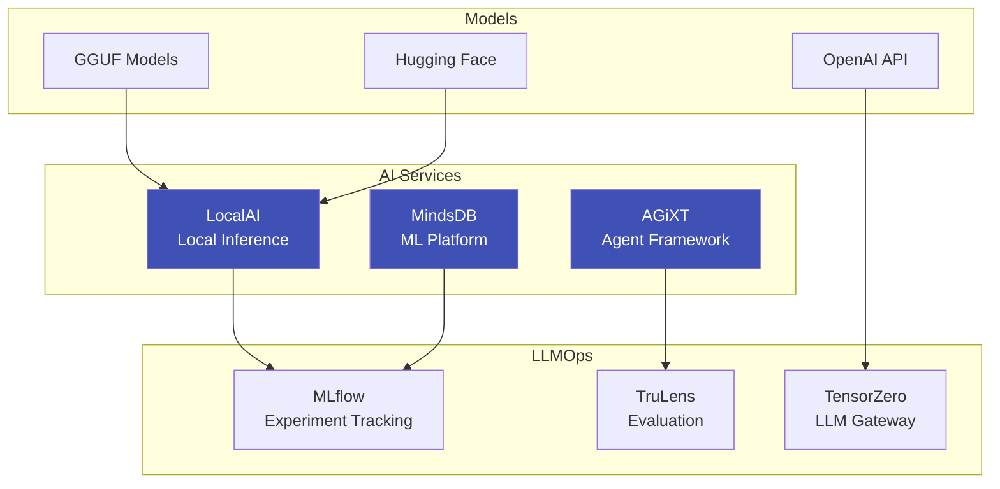

# AI & Machine Learning

ripple-env includes comprehensive AI and machine learning capabilities, from local LLM inference to ML experiment tracking.

## Overview



## Quick Start

=== "LocalAI"

    ```bash
    # Start LocalAI
    localai start

    # Test inference
    curl http://localhost:8080/v1/chat/completions \
      -H "Content-Type: application/json" \
      -d '{"model": "llama3", "messages": [{"role": "user", "content": "Hello!"}]}'
    ```

=== "AGiXT"

    ```bash
    # Start AGiXT
    agixt up

    # Access UI at http://localhost:8501
    ```

=== "MindsDB"

    ```bash
    # Start MindsDB
    mindsdb start

    # Access UI at http://localhost:47334
    ```

## Documentation

<div class="grid cards" markdown>

-   :material-server:{ .lg .middle } __LocalAI Setup__

    ---

    Configure local LLM inference with GGUF models

    [:octicons-arrow-right-24: LocalAI Guide](localai.md)

-   :material-cog:{ .lg .middle } __Inference Configuration__

    ---

    Advanced inference setup and optimization

    [:octicons-arrow-right-24: Inference Setup](inference.md)

-   :material-database:{ .lg .middle } __MindsDB__

    ---

    ML platform for automated machine learning

    [:octicons-arrow-right-24: MindsDB Guide](mindsdb.md)

-   :material-tools:{ .lg .middle } __GenAI Toolbox__

    ---

    Google's GenAI toolbox for database agents

    [:octicons-arrow-right-24: GenAI Toolbox](genai-toolbox.md)

-   :material-chart-line:{ .lg .middle } __LLMOps__

    ---

    Experiment tracking and evaluation

    [:octicons-arrow-right-24: LLMOps Guide](llmops.md)

</div>

## Supported Models

| Provider | Models | Backend |
|----------|--------|---------|
| Local (GGUF) | Llama 3, Mistral, Phi | LocalAI |
| Hugging Face | Transformers | Accelerate |
| OpenAI | GPT-4, GPT-3.5 | API |
| Anthropic | Claude | API |

## GPU Acceleration

For CUDA-enabled inference:

```bash
# Enter CUDA environment
nix develop .#cuda

# Or use Pixi CUDA feature
pixi run -e cuda python inference.py
```

!!! warning "GPU Requirements"
    CUDA support requires an NVIDIA GPU and appropriate drivers.
