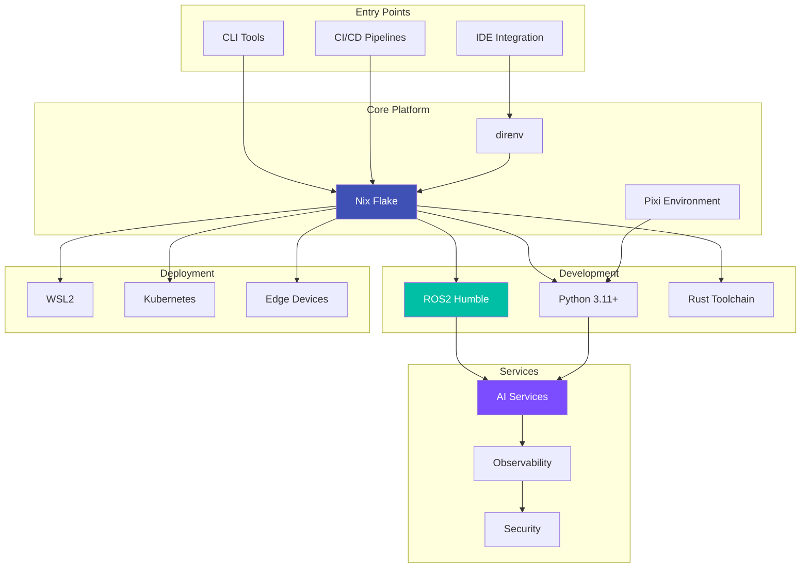
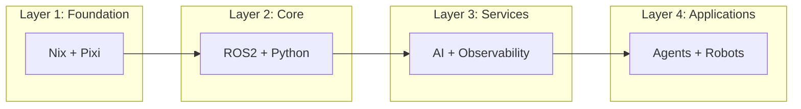

# Architecture

This section documents the system architecture, design decisions, and technical rationale behind ripple-env.

## System Overview

## Documentation

-   :material-sitemap:{ .lg .middle } __System Overview__

    ---

    High-level architecture and component relationships

    [:octicons-arrow-right-24: Overview](overview.md)

-   :simple-nixos:{ .lg .middle } __Nix Flake Design__

    ---

    Flake structure and modularization

    [:octicons-arrow-right-24: Nix Flake](nix-flake.md)

-   :material-robot:{ .lg .middle } __ARIA Orchestrator__

    ---

    Multi-agent orchestration architecture

    [:octicons-arrow-right-24: ARIA](aria.md)

-   :material-file-document:{ .lg .middle } __Decision Records__

    ---

    Architecture Decision Records (ADRs)

    [:octicons-arrow-right-24: ADRs](decisions/index.md)

## Design Principles

1. **Reproducibility**: Every build produces identical results
2. **Cross-platform**: Works on Linux, macOS, and Windows (WSL2)
3. **Modularity**: Components can be used independently
4. **Security-first**: mTLS, secrets management, SBOM by default
5. **Observable**: Built-in metrics, logging, and tracing

## Component Layers

See the [BUILDKIT_STARTER_SPEC.md](https://github.com/FlexNetOS/ripple-env/blob/main/BUILDKIT_STARTER_SPEC.md) for the complete layer specification.
