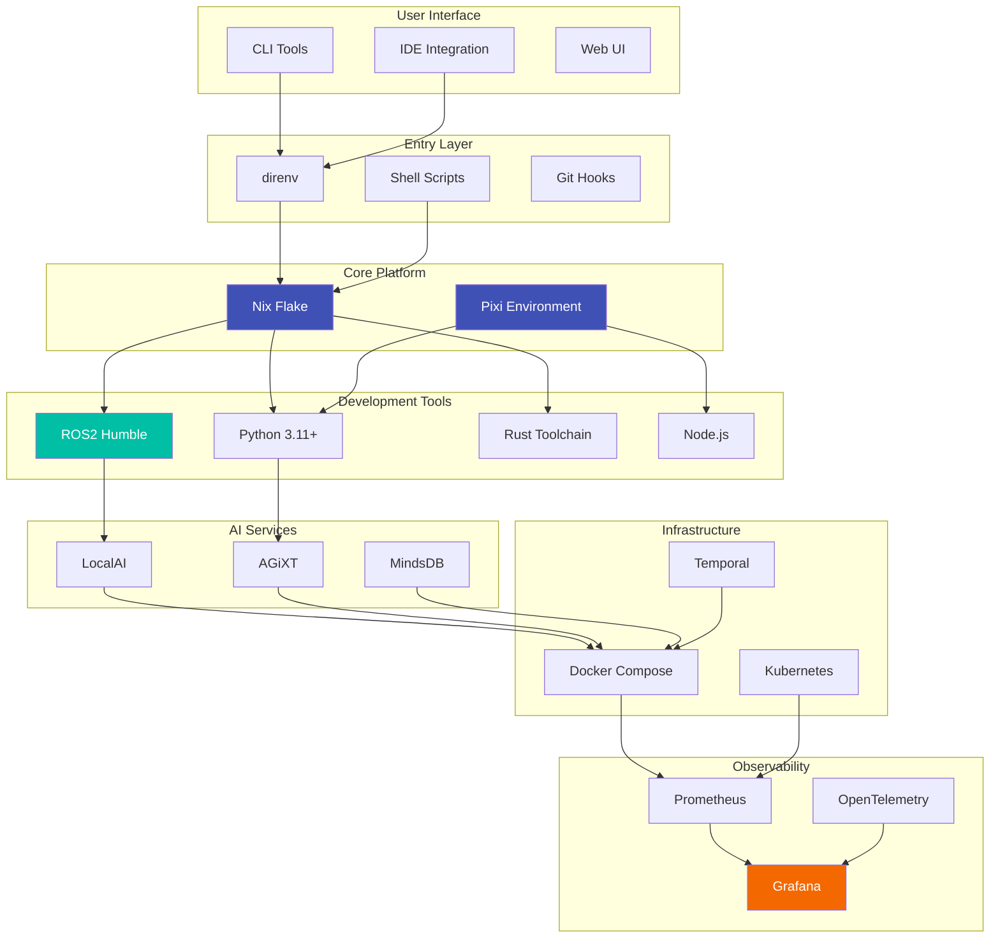
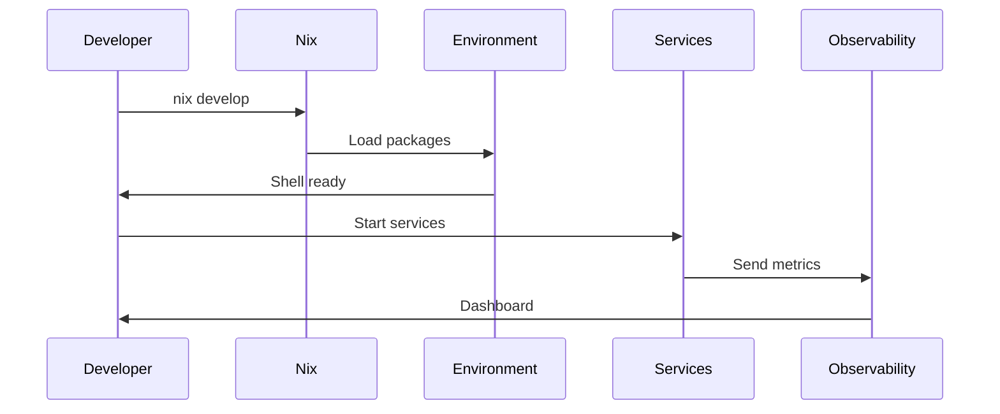

# System Overview

ripple-env is a cross-platform ROS2 development environment built on three pillars:

1. **Nix Flake**: Reproducible system packages
2. **Pixi**: Python and Conda ecosystem
3. **Docker Compose**: Containerized services

## Architecture Diagram

## Layer Architecture

The system follows a layered architecture as defined in BUILDKIT_STARTER_SPEC.md:

| Layer | Components | Purpose |
|-------|------------|---------|
| 1 | Nix, Pixi, direnv | Foundation |
| 2 | Git, Pre-commit | Version Control |
| 3 | Python, Rust, Node | Languages |
| 4 | ROS2, Colcon | Robotics |
| 5 | Testing, Linting | Quality |
| 6 | Docker, K8s | Containers |
| 7 | Temporal, NATS | Orchestration |
| 8 | AI Services | Intelligence |
| 9 | Security, mTLS | Protection |
| 10 | Observability | Monitoring |

## Data Flow

## Key Design Decisions

1. **Nix for reproducibility**: Ensures consistent environments across machines
2. **Pixi for Python**: Faster dependency resolution than conda
3. **direnv for activation**: Automatic environment loading
4. **Docker for services**: Isolated service deployment
5. **Flake-parts for modularity**: Composable Nix configuration
