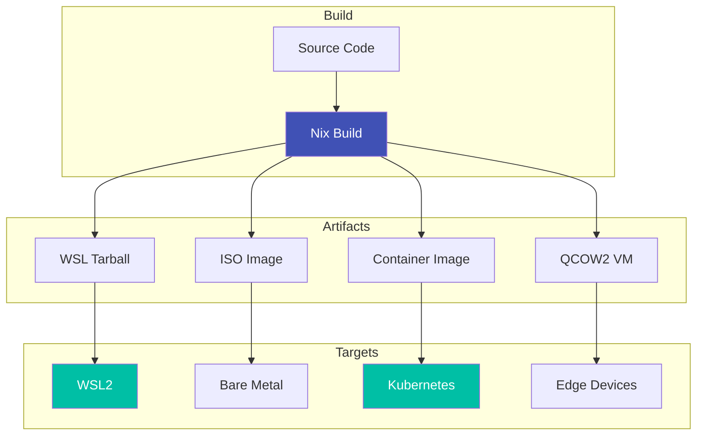

# Deployment

Deploy ripple-env to various platforms including WSL2, edge devices, and Kubernetes clusters.

## Overview



## Quick Start

=== "WSL2"

    ```powershell
    # Build WSL tarball
    nix build .#nixosConfigurations.wsl-ripple.config.system.build.tarballBuilder

    # Import to WSL
    wsl --import NixOS-Ripple $env:USERPROFILE\WSL\NixOS-Ripple result/nixos-wsl.tar.gz
    ```

=== "Container"

    ```bash
    # Build container image
    nix build .#dockerImage

    # Load into Docker
    docker load < result
    ```

=== "ISO"

    ```bash
    # Build ISO installer
    nix build .#nixosConfigurations.iso-ros2.config.system.build.isoImage
    ```

## Documentation

<div class="grid cards" markdown>

-   :material-chip:{ .lg .middle } __Edge Deployment__

    ---

    Deploy to Raspberry Pi, Jetson, and embedded devices

    [:octicons-arrow-right-24: Edge Guide](edge.md)

-   :material-microsoft-windows:{ .lg .middle } __WSL2 Pipeline__

    ---

    Windows Subsystem for Linux deployment

    [:octicons-arrow-right-24: WSL2 Guide](wsl2.md)

-   :simple-nixos:{ .lg .middle } __NixOS Images__

    ---

    Generate NixOS images for various targets

    [:octicons-arrow-right-24: NixOS Images](nixos-images.md)

-   :material-cube-outline:{ .lg .middle } __Kata Containers__

    ---

    Lightweight VM-based container runtime

    [:octicons-arrow-right-24: Kata Guide](kata.md)

</div>

## Supported Platforms

| Platform | Architecture | Status |
|----------|-------------|--------|
| Linux (NixOS) | x86_64, aarch64 | Supported |
| macOS | x86_64, arm64 | Supported |
| Windows (WSL2) | x86_64 | Supported |
| Raspberry Pi | aarch64 | Supported |
| Jetson | aarch64 | Supported |
| Kubernetes | any | Supported |
