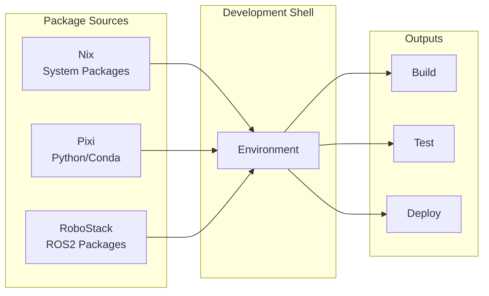
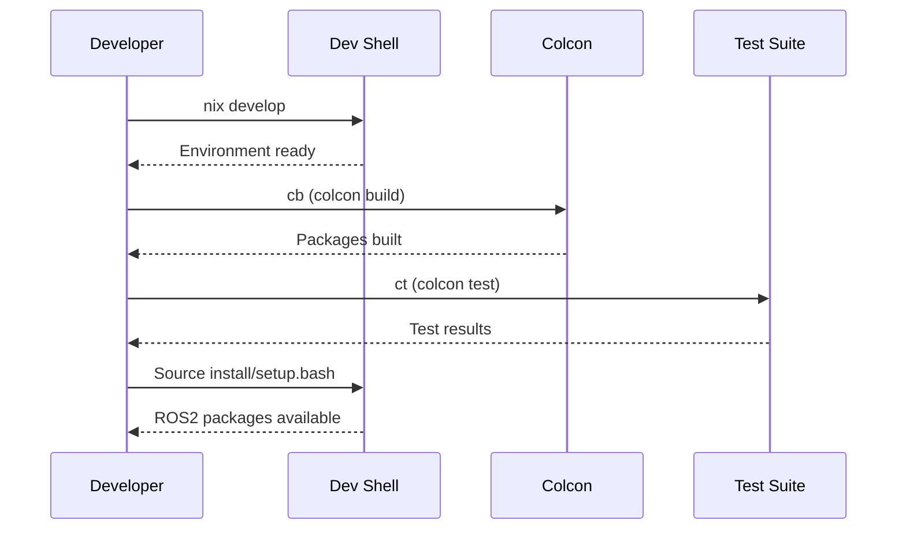

# Development

This section covers day-to-day development workflows, including Python environment management, ROS2 development, and testing.

## Overview

ripple-env provides a unified development environment that combines:

- **Nix**: System packages and reproducible builds
- **Pixi**: Python and Conda packages
- **ROS2**: Robot Operating System tools



## Quick Reference

### Essential Commands

```bash
# Enter development shell
nix develop

# Build all ROS2 packages
cb    # colcon build --symlink-install

# Run tests
ct    # colcon test

# Source ROS2 setup
source install/setup.bash
```

### Python Environment

```bash
# Check Python version
python --version  # Should be 3.11+

# Install a package with Pixi
pixi add package-name

# Use specific environment
pixi run -e cuda python script.py
```

## Documentation

<div class="grid cards" markdown>

-   :material-language-python:{ .lg .middle } __Python Environments__

    ---

    Managing Python with Nix and Pixi

    [:octicons-arrow-right-24: Python Guide](python-environments.md)

-   :material-robot:{ .lg .middle } __ROS2 Development__

    ---

    Building ROS2 packages and nodes

    [:octicons-arrow-right-24: ROS2 Guide](ros2.md)

-   :material-console:{ .lg .middle } __Shell Commands__

    ---

    Available shell commands and aliases

    [:octicons-arrow-right-24: Commands](shell-commands.md)

-   :material-test-tube:{ .lg .middle } __Testing__

    ---

    Running and writing tests

    [:octicons-arrow-right-24: Testing Guide](testing.md)

</div>

## Development Workflow


