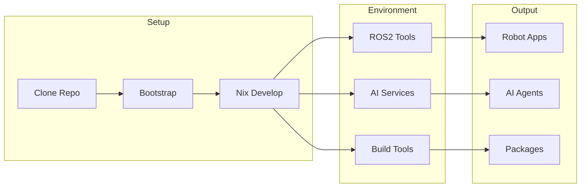

# Getting Started

Get up and running with ripple-env in minutes. This section covers installation, first steps, and troubleshooting.

## Prerequisites

Before you begin, ensure you have:

- **Git**: For cloning the repository
- **Nix**: Package manager (v2.4+ with flakes enabled)
- **Optional**: Docker for containerized services

!!! tip "Platform Support"
    ripple-env supports Linux, macOS, and Windows (via WSL2).

## Quick Installation

=== "Linux/macOS"

    ```bash
    # Clone the repository
    git clone https://github.com/FlexNetOS/ripple-env.git
    cd ripple-env

    # Run the bootstrap script
    ./bootstrap.sh

    # Enter the development shell
    nix develop
    ```

=== "Windows (WSL2)"

    ```powershell
    # From PowerShell (as Administrator)
    .\bootstrap.ps1

    # Then in WSL2
    cd ripple-env
    nix develop
    ```

## Next Steps

<div class="grid cards" markdown>

-   :material-download:{ .lg .middle } __Installation__

    ---

    Detailed installation instructions for all platforms

    [:octicons-arrow-right-24: Installation Guide](installation.md)

-   :material-rocket-launch:{ .lg .middle } __First Steps__

    ---

    Build your first ROS2 package

    [:octicons-arrow-right-24: First Steps](first-steps.md)

-   :material-bug:{ .lg .middle } __Troubleshooting__

    ---

    Common issues and solutions

    [:octicons-arrow-right-24: Troubleshooting](troubleshooting.md)

-   :material-chip:{ .lg .middle } __ARM64 Setup__

    ---

    Setup for Raspberry Pi and Jetson

    [:octicons-arrow-right-24: ARM64 Guide](arm64.md)

</div>

## Architecture



## Common Issues

| Issue | Solution |
|-------|----------|
| Nix flakes not enabled | Add `experimental-features = nix-command flakes` to `~/.config/nix/nix.conf` |
| Permission denied | Ensure Docker daemon is running and user is in docker group |
| Slow first build | First build downloads dependencies; subsequent builds use cache |

See [Troubleshooting](troubleshooting.md) for more solutions.
