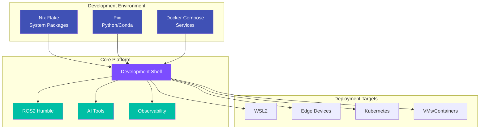

# ripple-env Documentation

Welcome to **ripple-env**, a cross-platform ROS2 Humble development environment built with Nix flakes and Pixi.

<div class="grid cards" markdown>

-   :material-clock-fast:{ .lg .middle } __Quick Start__

    ---

    Get up and running in minutes with our installation guide

    [:octicons-arrow-right-24: Getting Started](getting-started/index.md)

-   :material-robot:{ .lg .middle } __ROS2 Development__

    ---

    Build robotics applications with ROS2 Humble

    [:octicons-arrow-right-24: Development Guide](development/index.md)

-   :material-brain:{ .lg .middle } __AI & Machine Learning__

    ---

    Integrate LocalAI, MindsDB, and LLM inference

    [:octicons-arrow-right-24: AI & ML](ai-ml/index.md)

-   :material-server:{ .lg .middle } __Infrastructure__

    ---

    Deploy services with Docker, Kubernetes, and observability

    [:octicons-arrow-right-24: Infrastructure](infrastructure/index.md)

</div>

## Architecture Overview



## Quick Reference

### Common Commands

=== "Development"

    ```bash
    # Enter development shell
    nix develop

    # Build ROS2 packages
    cb    # alias for: colcon build --symlink-install

    # Run tests
    ct    # alias for: colcon test
    ```

=== "Services"

    ```bash
    # Start AI services
    agixt up
    localai start

    # Start workflow engine
    temporal-ctl start
    ```

=== "Security"

    ```bash
    # Generate SBOM
    sbom-generate

    # Run security audit
    sbom-audit
    ```

### Shell Variants

| Shell | Description | Command |
|-------|-------------|---------|
| Default | Standard development | `nix develop` |
| Full | All features enabled | `nix develop .#full` |
| CUDA | GPU acceleration | `nix develop .#cuda` |
| Humble | ROS2 Humble explicit | `nix develop .#humble` |
| Iron | ROS2 Iron | `nix develop .#iron` |
| Rolling | ROS2 Rolling (dev) | `nix develop .#rolling` |

## Documentation Sections

| Section | Description |
|---------|-------------|
| [Getting Started](getting-started/index.md) | Installation and first steps |
| [Development](development/index.md) | Day-to-day development guides |
| [AI & ML](ai-ml/index.md) | AI integration and inference |
| [Infrastructure](infrastructure/index.md) | Service deployment |
| [Security](security/index.md) | Security configuration |
| [Architecture](architecture/index.md) | System design and ADRs |
| [Deployment](getting-started/deployment/index.md) | Platform-specific deployment |
| [Reference](reference/index.md) | Technical reference |

## Key Features

- **Cross-platform**: Linux, macOS, Windows (WSL2)
- **Reproducible**: Nix flakes ensure consistent environments
- **AI-Ready**: LocalAI, MindsDB, and LLM inference built-in
- **Observable**: Prometheus, Grafana, and OpenTelemetry
- **Secure**: mTLS, secrets management, SBOM generation

## External Resources

<div class="grid cards" markdown>

-   :simple-ros:{ .lg .middle } __ROS2 Humble__

    ---

    Official ROS2 documentation

    [:octicons-arrow-right-24: docs.ros.org](https://docs.ros.org/en/humble/)

-   :simple-nixos:{ .lg .middle } __Nix Manual__

    ---

    Nix package manager documentation

    [:octicons-arrow-right-24: nixos.org](https://nixos.org/manual/nix/stable/)

-   :material-package:{ .lg .middle } __Pixi__

    ---

    Fast package manager for conda

    [:octicons-arrow-right-24: pixi.sh](https://pixi.sh/)

-   :material-github:{ .lg .middle } __Source Code__

    ---

    View the source on GitHub

    [:octicons-arrow-right-24: GitHub](https://github.com/FlexNetOS/ripple-env)

</div>
