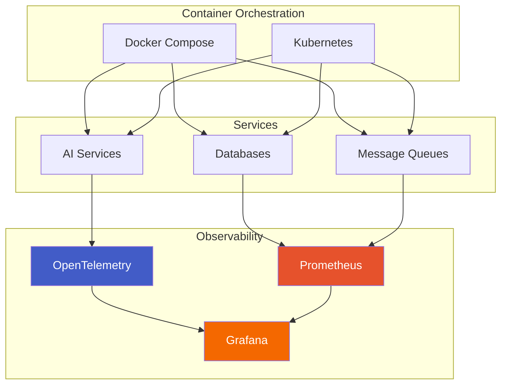

# Infrastructure

ripple-env provides a comprehensive infrastructure stack for deploying and managing services.

## Overview



## Quick Start

```bash
# Start core services
docker compose up -d

# Check service health
docker compose ps

# View logs
docker compose logs -f service-name
```

## Documentation

<div class="grid cards" markdown>

-   :material-docker:{ .lg .middle } __Docker Services__

    ---

    Service architecture and Docker Compose configuration

    [:octicons-arrow-right-24: Docker Guide](docker.md)

-   :material-chart-line:{ .lg .middle } __Observability__

    ---

    Prometheus, Grafana, and monitoring setup

    [:octicons-arrow-right-24: Observability](observability.md)

-   :material-vector-polyline:{ .lg .middle } __Distributed Tracing__

    ---

    OpenTelemetry and trace visualization

    [:octicons-arrow-right-24: Tracing Guide](tracing.md)

-   :material-clock-fast:{ .lg .middle } __Real-time Setup__

    ---

    PREEMPT_RT kernel configuration

    [:octicons-arrow-right-24: Real-time Guide](realtime.md)

</div>

## Service Stack

| Service | Port | Description |
|---------|------|-------------|
| LocalAI | 8080 | Local LLM inference |
| AGiXT | 8501 | Agent framework |
| MindsDB | 47334 | ML platform |
| Prometheus | 9090 | Metrics collection |
| Grafana | 3000 | Visualization |
| Temporal | 7233 | Workflow engine |
| NATS | 4222 | Message broker |
