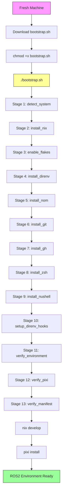
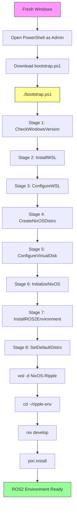
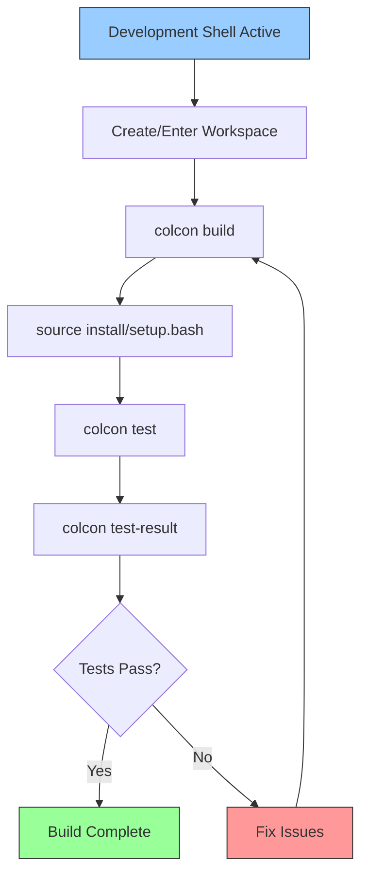
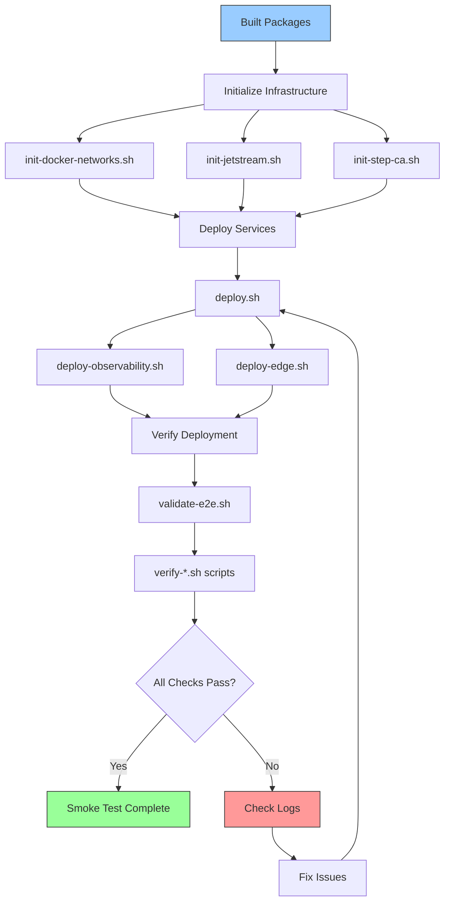
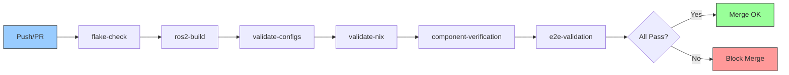

# Bootstrap Module — Golden Path Documentation

**Layer:** L3 (Orchestration)
**Criticality:** HIGH
**Surface:** external (user-facing)
**Runtime:** native, WSL
**Status:** verified
**Owner:** ripple-env maintainers

---

## Purpose

This module documents the **golden paths** for bootstrapping the ripple-env environment from a fresh machine to a fully operational ROS2 + AI/ML + DevOps stack.

---

## Golden Paths Overview

Four critical golden paths have been identified with evidence:

1. **GP-1: Fresh Machine → Full Stack** (Primary path)
2. **GP-2: Update Toolchain** (Maintenance path)
3. **GP-3: Build & Verify** (Development path)
4. **GP-4: Deploy & Smoke Test** (CI/CD path)

---

## GP-1: Fresh Machine → Full Stack

**Purpose:** Bootstrap complete environment from zero
**Time:** 15-30 minutes (depending on network + machine speed)
**Preconditions:** Fresh OS install (Linux/macOS/Windows)
**Postconditions:** ROS2 Humble environment active, all tools installed, verification passed

### Path Evidence

**Source files:**
- `./bootstrap.sh` (Linux/macOS): 1160 lines, 13 stages
- `./bootstrap.ps1` (Windows): 806 lines, 8 stages
- `README.md` lines 96-119, 167-211
- `docs/GETTING_STARTED.md` lines 16-51

### Linux/macOS Flow



### Windows (WSL2) Flow



### Detailed Stage Breakdown (Linux/macOS)

**Evidence:** `bootstrap.sh` lines 470-1159

| Stage | Function | Lines | Purpose | Idempotent | Evidence |
|-------|----------|-------|---------|------------|----------|
| 1 | `detect_system` | 471-547 | Detect OS/arch, validate compatibility | Yes | Skips if already run |
| 2 | `install_nix` | 560-624 | Install Nix with Determinate Systems installer | Yes | Checks `nix` command |
| 3 | `enable_flakes` | 627-660 | Enable experimental flakes feature | Yes | Checks nix.conf |
| 4 | `install_direnv` | 669-695 | Install direnv for auto-activation | Yes | Checks `direnv` command |
| 5 | `install_nom` | 698-724 | Install nix-output-monitor (optional) | Yes | Checks `nom` command |
| 6 | `install_git` | 727-753 | Install git | Yes | Checks `git` command |
| 7 | `install_gh` | 756-782 | Install GitHub CLI | Yes | Checks `gh` command |
| 8 | `install_zsh` | 785-817 | Install zsh shell | Yes (skippable) | Checks `zsh` command |
| 9 | `install_nushell` | 820-852 | Install nushell | Yes (skippable) | Checks `nu` command |
| 10 | `setup_direnv_hooks` | 855-882 | Setup shell hooks | Yes | Checks .bashrc/.zshrc |
| 11 | `verify_environment` | 885-925 | Verify flake + devshell | No (always run) | `nix flake check` |
| 12 | `verify_pixi` | 928-952 | Verify pixi setup | No (always run) | `pixi install` |
| 13 | `verify_manifest` | 955-1006 | Verify ARIA manifest components | No (optional) | Calls `validate-manifest.py` |

**Resume Support:** Yes
**Evidence:** Lines 189-251 (state persistence), `--resume` flag

**Retry Logic:** Yes
**Evidence:** Lines 108-147 (exponential backoff), applied to network operations

### Detailed Stage Breakdown (Windows/WSL2)

**Evidence:** `bootstrap.ps1` lines 254-795

| Stage | Function | Lines | Purpose | Idempotent | Evidence |
|-------|----------|-------|---------|------------|----------|
| 1 | `Test-WindowsVersion` | 260-275 | Check Windows build ≥ 19041 | Yes | Non-destructive |
| 2 | `Install-WSL` | 311-345 | Enable WSL2 + Virtual Machine Platform | Yes | Checks features |
| 3 | `Set-WSLConfig` | 462-488 | Write .wslconfig (memory/swap) | Yes | Overwrites config |
| 4 | `New-NixOSDistro` | 354-417 | Download + import NixOS-WSL tarball | Yes | Checks distro exists |
| 5 | `Set-VirtualDiskSize` | 419-460 | Resize ext4.vhdx to 1TB (default) | Caution | Uses diskpart |
| 6 | `Initialize-NixOSEnvironment` | 490-532 | Update channels, enable flakes | Yes | Idempotent commands |
| 7 | `Install-ROS2Environment` | 534-619 | Clone repo + run bootstrap.sh --ci | Yes | Git clone checks |
| 8 | `Set-DefaultDistro` | 621-631 | Set NixOS-Ripple as default | Yes | WSL command |

**Resume Support:** Yes
**Evidence:** Lines 189-252 (JSON state file), `-Resume` parameter

**Retry Logic:** Yes
**Evidence:** Lines 151-183 (exponential backoff), applied to downloads

### Command Examples

**Linux/macOS:**
```bash
# Standard bootstrap
./bootstrap.sh

# CI mode (non-interactive, skip shells)
./bootstrap.sh --ci --skip-shells

# Resume from failure
./bootstrap.sh --resume

# With verification
./bootstrap.sh --verify --profile default

# Clean state and restart
./bootstrap.sh --clean

# Debug mode with logging
./bootstrap.sh --debug --log-file /tmp/bootstrap.log
```

**Windows (PowerShell as Admin):**
```powershell
# Standard bootstrap
.\bootstrap.ps1

# Custom configuration
.\bootstrap.ps1 -DistroName "MyRipple" -DiskSizeGB 512 -SwapSizeGB 16

# Resume from failure
.\bootstrap.ps1 -Resume

# Skip shells
.\bootstrap.ps1 -SkipShells

# Force reinstall
.\bootstrap.ps1 -Force

# Clean state
.\bootstrap.ps1 -Clean
```

### Post-Bootstrap Verification

**Evidence:** `bootstrap.sh` lines 885-1054

After bootstrap completes, verify with:

```bash
# Enter development shell
nix develop

# OR (nicer output)
nom develop

# OR (with direnv)
cd ripple-env && direnv allow

# Verify ROS2
ros2 --help

# Verify pixi
pixi --version

# Verify Python
python --version

# Run full verification (if installed)
./scripts/validate-e2e.sh
```

### Known Issues & Workarounds

**Evidence:** `README.md` lines 7-94 (WSL stability guide)

1. **WSL Memory Pressure:**
   - **Symptom:** Commands fail, window reloads
   - **Fix:** Run `./scripts/fix-wsl-stability.sh`
   - **Permanent:** Copy `.wslconfig` to Windows user profile

2. **Network Timeouts:**
   - **Symptom:** Downloads fail during bootstrap
   - **Fix:** Retry logic auto-handles (4 attempts, exponential backoff)
   - **Manual:** Re-run with `--resume`

3. **Disk Space:**
   - **Symptom:** Nix store full
   - **Fix:** `nix-collect-garbage -d`
   - **Prevention:** Ensure 20GB+ free space

4. **Flake Check Failures:**
   - **Symptom:** `nix flake check` errors
   - **Fix:** `nix flake update` + retry
   - **Evidence:** `bootstrap.sh` lines 900-914

---

## GP-2: Update Toolchain

**Purpose:** Update pinned versions and dependencies
**Time:** 5-10 minutes
**Preconditions:** Existing ripple-env installation
**Postconditions:** All tools updated, lock files regenerated

### Flow


### Command Sequence

**Evidence:** `README.md` lines 195-204, `docs/GETTING_STARTED.md` lines 193-204

```bash
# 1. Pull latest repo changes
git pull origin main

# 2. Update Nix flake lock file
nix flake update

# 3. Update pixi packages
pixi update

# 4. Rebuild development shell
nix develop --rebuild

# 5. Verify flake is valid
nix flake check

# 6. Verify pixi environment
pixi list
```

### Maintenance Scripts

**Evidence:** Phase 1 CATALOG.json

| Script | Purpose | Evidence |
|--------|---------|----------|
| `upgrade-python-deps.sh` | Upgrade Python deps | scripts/upgrade-python-deps.sh (8633 bytes) |
| `check-python-deps.sh` | Check Python versions | scripts/check-python-deps.sh (9470 bytes) |
| `validate-channels.py` | Validate pixi channels | scripts/validate-channels.py (16806 bytes) |

---

## GP-3: Build & Verify

**Purpose:** Build ROS2 packages and run tests
**Time:** Variable (depends on package count)
**Preconditions:** Development environment active
**Postconditions:** Packages built, tests passed

### Flow



### Command Sequence

**Evidence:** `README.md` lines 350-366, `docs/GETTING_STARTED.md` lines 138-163

```bash
# 1. Create workspace (first time)
mkdir -p ~/ros2_ws/src
cd ~/ros2_ws

# 2. Build packages (shorthand: cb)
colcon build --symlink-install

# 3. Source the workspace
source install/setup.bash

# 4. Run tests (shorthand: ct)
colcon test

# 5. View test results (shorthand: ctr)
colcon test-result --verbose

# 6. Build specific package
colcon build --packages-select my_package

# 7. Clean build
rm -rf build install log
colcon build --symlink-install
```

### Makefile Integration

**Evidence:** `Makefile` (Phase 1 discovery)

```bash
# Makefile targets (portable)
make test     # Run tests
make build    # Build packages
make deploy   # Deploy stack
make doctor   # System check
make monitor  # Start monitoring
```

---

## GP-4: Deploy & Smoke Test

**Purpose:** Deploy full stack and verify operational
**Time:** 10-20 minutes (first run), 2-5 minutes (subsequent)
**Preconditions:** Build complete, Docker available
**Postconditions:** All services running, smoke tests passed

### Flow



### Command Sequence (Inferred from scripts)

**Evidence:** Phase 1 script discovery + docker-compose files

```bash
# 1. Initialize infrastructure
./scripts/init-docker-networks.sh
./scripts/init-jetstream.sh
./scripts/init-step-ca.sh

# 2. Deploy main stack
./scripts/deploy.sh

# 3. Deploy observability
./scripts/deploy-observability.sh

# 4. Deploy edge services (optional)
./scripts/deploy-edge.sh

# 5. Run end-to-end validation
./scripts/validate-e2e.sh

# 6. Run component verification
./scripts/verify-argo-workflows.sh
./scripts/verify-observability.sh
./scripts/verify-jetstream.sh
# ... (10 verify-* scripts total)

# 7. Check service health
./scripts/health-check.sh

# 8. Run security audit
./scripts/security-audit.sh
```

### Docker Compose Stacks

**Evidence:** Phase 1 CATALOG.json (22 stacks)

```bash
# Start core services
docker compose -f docker/docker-compose.yml up -d

# Start observability
docker compose -f docker/docker-compose.observability.yml up -d

# Start AI/ML services
docker compose -f docker/docker-compose.inference.yml up -d
docker compose -f docker/docker-compose.localai.yml up -d
docker compose -f docker/docker-compose.agixt.yml up -d

# Start messaging
docker compose -f docker/docker-compose.messaging.yml up -d
docker compose -f docker/docker-compose.temporal.yml up -d

# Check status
docker compose ps
```

### CI Pipeline Integration

**Evidence:** `.github/workflows/ci.yml`, `.github/workflows/e2e-validation.yml`

CI follows this path:



**CI Evidence:**
- `ci.yml` lines 19-100: Nix flake check + ROS2 build
- `e2e-validation.yml` lines 19-100: Config validation + Nix validation

---

## Unknowns & Future Work

### Phase 2 Gaps (Require Investigation)

1. **Exact deploy.sh flow:** Script exists but flow requires Phase 4 analysis
2. **Artifact output locations:** Build artifacts destination not documented
3. **Service dependencies:** Exact startup order requires verification
4. **Health check criteria:** Success/failure thresholds not documented
5. **Rollback procedures:** Failure recovery path not documented

### Questions for Phase 4

1. What does `deploy.sh` actually do? (read script)
2. What environment variables are required? (extract from scripts)
3. What ports are exposed? (extract from docker-compose)
4. What are the failure modes? (extract error handling)
5. How to rollback a deployment? (look for rollback scripts)

---

## References

**Evidence Files:**
- `./bootstrap.sh` (1160 lines)
- `./bootstrap.ps1` (806 lines)
- `./README.md` (lines 96-873)
- `./docs/GETTING_STARTED.md` (272 lines)
- `./Makefile` (97 lines)
- `./.github/workflows/ci.yml`
- `./.github/workflows/e2e-validation.yml`
- `./scripts/deploy.sh`
- `./scripts/validate-e2e.sh`
- `./scripts/verify-*.sh` (10 scripts)
- `./docker/docker-compose*.yml` (22 files)

**Phase 1 Deliverables:**
- `docs/CATALOG.json` — Machine-readable entrypoint catalog
- `docs/AUDIT_PROGRESS_REPORT.md` — Phase 1 completion report

---

**Last Updated:** 2026-01-13 (Phase 2)
**Next Update:** Phase 4 (Script Contract Analysis)
