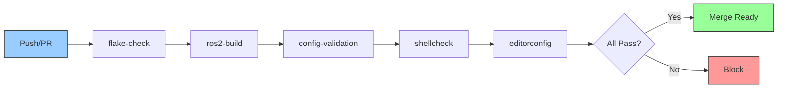
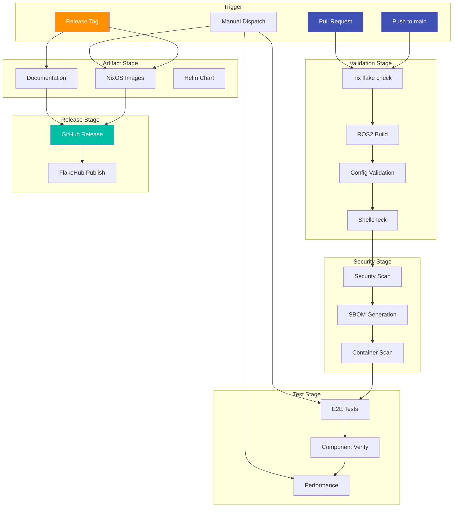

# CI/CD Module

**Layer:** L3 (Orchestration)
**Criticality:** HIGH
**Surface:** external
**Runtime:** GitHub Actions
**Status:** verified
**Owner:** ripple-env maintainers

---

## Purpose

This module documents the CI/CD pipeline architecture, workflow triggers, artifacts, and deployment gates.

---

## Workflow Overview

### GitHub Actions Inventory

**Evidence:** `.github/workflows/` (30+ workflows)

| Category | Workflow Count | Purpose |
|----------|----------------|---------|
| Core CI | 4 | Build, test, lint |
| Security | 5 | Scanning, SBOM, attestation |
| Validation | 6 | Config, E2E, K8s |
| Testing | 5 | Bootstrap, AI tools, Python matrix |
| Images | 3 | NixOS, WSL2, Docker |
| Performance | 3 | Benchmarks, latency |
| Release | 3 | Publishing, FlakeHub |

### Main CI Pipeline

**Evidence:** `.github/workflows/ci.yml`

---

## Workflow Details

### Core CI

| Workflow | Trigger | Jobs | Purpose |
|----------|---------|------|---------|
| `ci.yml` | push, PR | flake-check, ros2-build | Main pipeline |
| `shellcheck.yml` | push, PR | lint | Shell script validation |
| `editorconfig.yml` | push, PR | check | EditorConfig enforcement |
| `config-validation.yml` | push, PR | validate | YAML/JSON/TOML syntax |

### Security Workflows

| Workflow | Trigger | Jobs | Purpose |
|----------|---------|------|---------|
| `security.yml` | push, PR | dependency-audit, secret-scan | Vulnerability scanning |
| `sbom.yml` | manual, release | generate, sign | SBOM generation |
| `attestation.yml` | manual | provenance | Build attestation |
| `container-security.yml` | push, manual | trivy-scan | Container scanning |
| `opa-policy-gate.yml` | manual | policy-test | OPA policy validation |

### Validation Workflows

| Workflow | Trigger | Jobs | Purpose |
|----------|---------|------|---------|
| `e2e-validation.yml` | manual | full-stack-test | End-to-end testing |
| `component-verification.yml` | manual | verify-all | Component health checks |
| `k8s-validation.yml` | manual | manifest-check, kustomize | Kubernetes validation |
| `snapshot-replay.yml` | manual | replay-test | State replay testing |

### Testing Workflows

| Workflow | Trigger | Jobs | Purpose |
|----------|---------|------|---------|
| `bootstrap-test.yml` | manual, push | bootstrap-linux, bootstrap-windows | Bootstrap validation |
| `test-bootstrap.yml` | push | multi-os-test | Multi-platform bootstrap |
| `python-matrix.yml` | manual | py39-py312 | Python version matrix |
| `agixt-test.yml` | manual | agixt-integration | AGiXT integration |
| `localai-test.yml` | manual | localai-integration | LocalAI integration |
| `verify-ai-tools.yml` | manual | tool-health | AI tool verification |
| `eval-gate.yml` | manual | llm-eval | LLM evaluation gate |

### Image Workflows

| Workflow | Trigger | Jobs | Purpose |
|----------|---------|------|---------|
| `nixos-images.yml` | manual, release | iso, vm, wsl | NixOS image generation |
| `wsl2-build.yml` | manual | wsl-tarball | WSL2 image build |
| `docs.yml` | push (main) | mkdocs-build | Documentation site |

### Performance Workflows

| Workflow | Trigger | Jobs | Purpose |
|----------|---------|------|---------|
| `benchmarks.yml` | manual | build-time, artifact-size | Build benchmarks |
| `performance.yml` | manual | throughput, latency | Performance testing |
| `realtime-latency.yml` | manual | jitter, deadline | Real-time validation |

### Release Workflows

| Workflow | Trigger | Jobs | Purpose |
|----------|---------|------|---------|
| `release.yml` | tag | version-bump, release | Release automation |
| `flakehub-publish-tagged.yml` | tag | publish | FlakeHub publishing |

---

## CI/CD Flow Diagram

**See:** [graphs/ci_flow.mmd](../graphs/ci_flow.mmd)

---

## Artifacts

### Build Artifacts

**Evidence:** Workflow artifact uploads

| Artifact | Workflow | Retention | Purpose |
|----------|----------|-----------|---------|
| `nixos-wsl.tar.gz` | nixos-images | 90 days | WSL2 image |
| `nixos-*.iso` | nixos-images | 90 days | ISO installer |
| `sbom-*.json` | sbom | 90 days | SBOM report |
| `test-results.xml` | ci | 30 days | Test results |

### Published Artifacts

| Artifact | Destination | Trigger |
|----------|-------------|---------|
| Nix flake | FlakeHub | Release tag |
| Documentation | GitHub Pages | Push to main |
| Container images | GHCR (planned) | Release tag |

---

## Gates and Checks

### Required Checks for Merge

**Evidence:** Repository branch protection

| Check | Blocking | Bypass |
|-------|----------|--------|
| `nix flake check` | Yes | Admin only |
| `ros2-build` | Yes | Admin only |
| `shellcheck` | Yes | Admin only |
| `editorconfig` | No | - |
| `security` | Yes | Admin only |

### Manual Approval Gates

| Workflow | Approval Required | Approvers |
|----------|-------------------|-----------|
| Production deploy | Yes | Maintainers |
| Secret rotation | Yes | Admins |
| Major version upgrade | Yes | Maintainers |

---

## Environment Variables

### Workflow Secrets

**Evidence:** GitHub repository secrets

| Secret | Scope | Purpose |
|--------|-------|---------|
| `GITHUB_TOKEN` | All workflows | GitHub API access |
| `CACHIX_AUTH_TOKEN` | CI | Nix cache upload |
| `FLAKEHUB_TOKEN` | Release | FlakeHub publish |

### Workflow Variables

| Variable | Purpose |
|----------|---------|
| `NIX_VERSION` | Nix installer version |
| `PYTHON_VERSION` | Default Python version |

---

## Branch Protection

**Evidence:** `docs/rules/BRANCH-PROTECTION.md`

| Rule | Enabled | Configuration |
|------|---------|---------------|
| Require PR | Yes | No direct push to main |
| Require reviews | Yes | 1 approval minimum |
| Require status checks | Yes | CI must pass |
| Require up-to-date | Yes | Branch must be current |
| Restrict force push | Yes | Admins only |

---

## Scheduled Jobs

| Workflow | Schedule | Purpose |
|----------|----------|---------|
| `security.yml` | Weekly | Dependency audit |
| `sbom.yml` | Weekly | SBOM refresh |
| (planned) `stale.yml` | Daily | Stale issue cleanup |

---

## Related Docs

- [graphs/ci_flow.mmd](../graphs/ci_flow.mmd) - CI flow diagram
- [graphs/cicd-main-flow.mmd](../graphs/cicd-main-flow.mmd) - Full CICD flow
- [ARTIFACTS.md](../ARTIFACTS.md) - Build artifacts
- [BRANCH-PROTECTION.md](../rules/BRANCH-PROTECTION.md) - Branch rules
- [SUPPLY_CHAIN_SECURITY.md](../security/SUPPLY_CHAIN_SECURITY.md) - Supply chain

---

**Last Updated:** 2026-01-14
