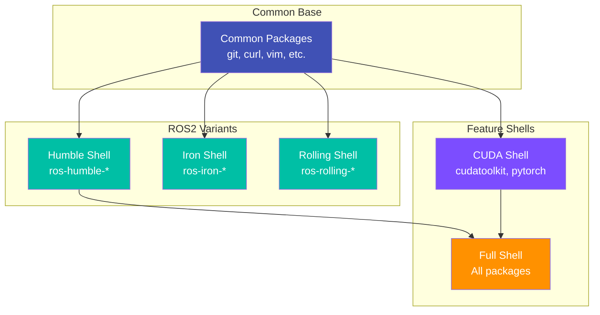

# Environments Module

**Layer:** L2 (Environments)
**Criticality:** HIGH
**Surface:** internal
**Runtime:** native, container, WSL
**Status:** verified
**Owner:** ripple-env maintainers

---

## Purpose

This module documents the environment taxonomy, overlay system, and configuration precedence for the ripple-env development environment.

---

## Environment Taxonomy

### Pixi Environments (from `pixi.toml`)

**Evidence:** `pixi.toml` lines 1-800+

| Environment | Solve Group | Features | Purpose |
|-------------|-------------|----------|---------|
| `default` | default | base | Base ROS2 Humble environment |
| `cuda` | cuda | cuda | CUDA-enabled PyTorch |
| `aios` | aios | aios | AIOS Agent Operating System |
| `aios-cuda` | aios-cuda | aios, aios-cuda, cuda | AIOS with GPU acceleration |
| `llmops` | llmops | llmops | LLMOps evaluation (MLflow, TruLens) |
| `finetuning` | finetuning | finetuning | LLM finetuning (Unsloth) |
| `finetuning-cuda` | finetuning-cuda | finetuning, cuda | Finetuning with GPU |
| `caching` | caching | caching | LLM response caching |
| `docs` | docs | docs | Documentation generation (MkDocs) |
| `vectordb-chromadb` | vectordb-chromadb | vectordb-chromadb | ChromaDB vector database |
| `vectordb-ruvector` | vectordb-ruvector | vectordb-ruvector | RuVector vector database |
| `qudag` | qudag | qudag | Quantum-resistant DAG communications |

### Platform Support

**Evidence:** `pixi.toml` platforms section

| Platform | Identifier | Bootstrap Script |
|----------|------------|------------------|
| Linux x64 | `linux-64` | `bootstrap.sh` |
| Linux ARM64 | `linux-aarch64` | `bootstrap.sh` |
| macOS Intel | `osx-64` | `bootstrap.sh` |
| macOS Apple Silicon | `osx-arm64` | `bootstrap.sh` |
| Windows | `win-64` | `bootstrap.ps1` (via WSL2) |

---

## Nix Shell Variants

### DevShell Definitions

**Evidence:** `flake.nix`, `nix/shells/`

| Shell | Command | Purpose |
|-------|---------|---------|
| default | `nix develop` | Standard development environment |
| full | `nix develop .#full` | All features enabled |
| cuda | `nix develop .#cuda` | GPU acceleration (Linux only) |
| humble | `nix develop .#humble` | ROS2 Humble explicit |
| iron | `nix develop .#iron` | ROS2 Iron |
| rolling | `nix develop .#rolling` | ROS2 Rolling (development) |

### Shell Features by Variant

**Evidence:** `nix/shells/multi-distro/`



---

## Configuration Precedence

### Environment Variable Resolution Order

**Evidence:** `scripts/env-vars.sh`, `.envrc`

```
1. Command-line arguments (highest priority)
2. Environment variables (current shell)
3. .env.local (local overrides, gitignored)
4. .env (committed defaults)
5. direnv (.envrc auto-loading)
6. Nix shell environment variables
7. System environment (lowest priority)
```

### Nix Configuration Precedence

**Evidence:** `flake.nix`, `nix.conf`

```
1. Command-line flags (--override-input, etc.)
2. flake.nix inputs
3. ~/.config/nix/nix.conf
4. /etc/nix/nix.conf
5. Built-in defaults
```

### Pixi Configuration Precedence

**Evidence:** `pixi.toml`

```
1. Environment-specific dependencies
2. Feature dependencies
3. Base dependencies
4. Channel packages (robostack-humble > conda-forge > pytorch)
```

---

## Overlay System

### Docker Compose Overlays

**Evidence:** `docker/docker-compose*.yml` (22 files)

| Base Stack | Overlay Files | Purpose |
|------------|---------------|---------|
| Core | `docker-compose.yml` | Main services |
| AI/ML | `docker-compose.inference.yml`, `docker-compose.localai.yml`, `docker-compose.agixt.yml` | AI inference |
| Data | `docker-compose.data.yml`, `docker-compose.state.yml` | Databases |
| Messaging | `docker-compose.messaging.yml`, `docker-compose.temporal.yml` | Event systems |
| Observability | `docker-compose.observability.yml` | Monitoring |
| Identity | `docker-compose.identity.yml` | Auth/secrets |
| Edge | `docker-compose.edge.yml` | Gateway |

### Usage Pattern

```bash
# Core only
docker compose -f docker/docker-compose.yml up -d

# Core + AI
docker compose -f docker/docker-compose.yml \
               -f docker/docker-compose.inference.yml up -d

# Full stack
docker compose -f docker/docker-compose.yml \
               -f docker/docker-compose.observability.yml \
               -f docker/docker-compose.messaging.yml \
               -f docker/docker-compose.identity.yml up -d
```

---

## Platform-Specific Configurations

### Linux

**Evidence:** `modules/linux/`

- systemd service files
- udev rules for hardware
- Docker native networking
- Real-time kernel support (optional)

### macOS

**Evidence:** `modules/macos/`

- Homebrew integration
- macOS system preferences
- Docker Desktop networking
- Rosetta 2 for x86 packages (Apple Silicon)

### Windows (WSL2)

**Evidence:** `bootstrap.ps1`, `.wslconfig`

- WSL2 memory/swap configuration
- Virtual disk management
- Windows host networking
- GPU passthrough (WSL2 + CUDA)

---

## Environment Variables Registry

**See:** [ENV_VAR_REGISTRY.md](../ENV_VAR_REGISTRY.md)

Key environment variables:

| Variable | Default | Purpose |
|----------|---------|---------|
| `ROS_DISTRO` | `humble` | ROS2 distribution |
| `RMW_IMPLEMENTATION` | `rmw_cyclonedds_cpp` | ROS2 middleware |
| `PIXI_HOME` | `~/.pixi` | Pixi installation |
| `NIX_PATH` | (auto) | Nix channel paths |
| `DIRENV_LOG_FORMAT` | (empty) | Suppress direnv logs |

---

## Secrets Integration

**Evidence:** `docs/secrets/SECRETS.md`, `secrets/secrets.nix`

Secrets are injected into environments via:

1. **agenix** - Encrypted secrets for NixOS
2. **Vault** - Runtime secrets for containers
3. **.env files** - Development secrets (gitignored)
4. **GitHub Secrets** - CI/CD secrets

---

## Graphs

### Environment Layering

See: [graphs/env_layering.mmd](../graphs/env_layering.mmd)

---

## Related Docs

- [Bootstrap Module](bootstrap.md) - Environment setup procedures
- [Toolchain Module](toolchain.md) - Package management
- [ENV_VAR_REGISTRY.md](../ENV_VAR_REGISTRY.md) - Complete variable list
- [PYTHON-ENVIRONMENTS.md](../PYTHON-ENVIRONMENTS.md) - Python specifics
- [CONFLICTS.md](../CONFLICTS.md) - Version conflicts

---

**Last Updated:** 2026-01-14
