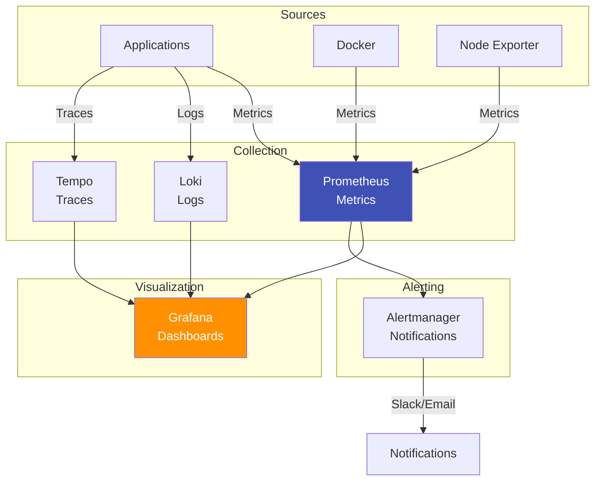

# Observability Module

**Layer:** L5 (Operations)
**Criticality:** HIGH
**Surface:** internal
**Runtime:** container
**Status:** verified
**Owner:** ripple-env maintainers

---

## Purpose

This module documents the observability stack for monitoring, logging, and tracing the ripple-env development and deployment pipelines.

---

## Observability Stack

### Components

**Evidence:** `docker/docker-compose.observability.yml`



---

## Metrics (Prometheus)

### Configuration

**Evidence:** `config/prometheus/prometheus.yml`

| Attribute | Value |
|-----------|-------|
| Port | 9090 |
| Retention | 15d |
| Scrape Interval | 15s |
| Config | `config/prometheus/prometheus.yml` |

### Scrape Targets

| Target | Port | Metrics Path |
|--------|------|--------------|
| Prometheus | 9090 | `/metrics` |
| Grafana | 3000 | `/metrics` |
| Node Exporter | 9100 | `/metrics` |
| Docker | 9323 | `/metrics` |
| LocalAI | 8080 | `/metrics` |
| NATS | 8222 | `/metrics` |
| Temporal | 7233 | `/metrics` |

### Key Metrics

| Metric | Purpose | Alert Threshold |
|--------|---------|-----------------|
| `up` | Service availability | == 0 |
| `process_cpu_seconds_total` | CPU usage | > 80% |
| `process_resident_memory_bytes` | Memory usage | > 90% |
| `http_requests_total` | Request count | N/A |
| `http_request_duration_seconds` | Latency | P95 > 1s |

---

## Logging (Loki)

### Configuration

**Evidence:** `docker/docker-compose.observability.yml`

| Attribute | Value |
|-----------|-------|
| Port | 3100 |
| Retention | 7d |
| Storage | Local filesystem |

### Log Sources

| Source | Driver | Labels |
|--------|--------|--------|
| Docker containers | Loki driver | `container_name`, `service` |
| Application logs | Promtail | `app`, `level` |
| System logs | Promtail | `host`, `unit` |

### Log Queries (LogQL)

```logql
# Error logs from all services
{level="error"}

# Logs from specific service
{container_name="localai"} |= "error"

# Logs with latency > 1s
{service="api"} | json | latency_ms > 1000
```

---

## Tracing (Tempo)

### Configuration

**Evidence:** `config/tempo/tempo.yaml`

| Attribute | Value |
|-----------|-------|
| Query Port | 3200 |
| Jaeger gRPC | 14250 |
| Jaeger HTTP | 14268 |
| OTLP gRPC | 4317 |
| OTLP HTTP | 4318 |
| Retention | 7d |

### Trace Ingestion

| Protocol | Port | Client Libraries |
|----------|------|------------------|
| OTLP gRPC | 4317 | OpenTelemetry |
| OTLP HTTP | 4318 | OpenTelemetry |
| Jaeger | 14250/14268 | Jaeger clients |
| Zipkin | 9411 | Zipkin clients |

### Trace Attributes

| Attribute | Purpose |
|-----------|---------|
| `service.name` | Service identifier |
| `http.method` | HTTP method |
| `http.status_code` | Response code |
| `db.system` | Database type |
| `messaging.system` | Message broker |

---

## Visualization (Grafana)

### Configuration

**Evidence:** `config/grafana/provisioning/`

| Attribute | Value |
|-----------|-------|
| Port | 3000 |
| Auth | Credentials |
| Provisioning | `config/grafana/provisioning/` |

### Data Sources

| Source | Type | URL |
|--------|------|-----|
| Prometheus | prometheus | `http://prometheus:9090` |
| Loki | loki | `http://loki:3100` |
| Tempo | tempo | `http://tempo:3200` |

### Dashboards

**Evidence:** `config/grafana/provisioning/dashboards/`

| Dashboard | Purpose |
|-----------|---------|
| Overview | System health summary |
| Services | Per-service metrics |
| Logs | Log explorer |
| Traces | Trace explorer |
| ROS2 | ROS2-specific metrics |

---

## Alerting (Alertmanager)

### Configuration

**Evidence:** `config/alertmanager/config.yml`

| Attribute | Value |
|-----------|-------|
| Port | 9093 |
| Config | `config/alertmanager/config.yml` |

### Alert Routes

```yaml
route:
  receiver: 'default'
  group_by: ['alertname', 'severity']
  group_wait: 30s
  group_interval: 5m
  repeat_interval: 4h

  routes:
    - match:
        severity: critical
      receiver: 'critical'
    - match:
        severity: warning
      receiver: 'warning'
```

### Alert Rules

**Evidence:** `config/prometheus/alerts/`

| Alert | Condition | Severity |
|-------|-----------|----------|
| ServiceDown | `up == 0 for 5m` | critical |
| HighCPU | `cpu > 80% for 10m` | warning |
| HighMemory | `memory > 90% for 10m` | warning |
| HighLatency | `P95 > 1s for 5m` | warning |
| DiskFull | `disk > 85%` | critical |

---

## Deployment

### Docker Compose

```bash
# Start observability stack
docker compose -f docker/docker-compose.observability.yml up -d

# Verify deployment
./scripts/verify-observability.sh

# Access Grafana
open http://localhost:3000
```

### Verification

**Evidence:** `scripts/verify-observability.sh`

```bash
# Check all endpoints
curl http://localhost:9090/-/healthy     # Prometheus
curl http://localhost:3100/ready          # Loki
curl http://localhost:3200/ready          # Tempo
curl http://localhost:3000/api/health     # Grafana
curl http://localhost:9093/-/healthy      # Alertmanager
```

---

## Operational Procedures

### Log Viewing

```bash
# Grafana Explore (recommended)
open http://localhost:3000/explore

# LogCLI (command line)
logcli query '{container_name="localai"}'

# Docker logs (fallback)
docker logs localai --tail 100 -f
```

### Metric Queries

```bash
# Prometheus UI
open http://localhost:9090/graph

# PromQL examples
up                                          # All services status
rate(http_requests_total[5m])               # Request rate
histogram_quantile(0.95, http_duration)     # P95 latency
```

### Trace Exploration

```bash
# Grafana Tempo
open http://localhost:3000/explore?orgId=1&left=...

# Jaeger UI (if enabled)
open http://localhost:16686
```

---

## Resource Requirements

| Component | CPU | Memory | Disk |
|-----------|-----|--------|------|
| Prometheus | 0.5 | 512MB | 10GB |
| Loki | 0.25 | 256MB | 5GB |
| Tempo | 0.25 | 256MB | 5GB |
| Grafana | 0.25 | 256MB | 1GB |
| Alertmanager | 0.1 | 128MB | 100MB |
| **Total** | **1.35** | **1.4GB** | **21GB** |

---

## Related Docs

- [OBSERVABILITY-QUICK-START.md](../getting-started/quick-start/OBSERVABILITY-QUICK-START.md) - Quick start
- [infrastructure/observability.md](../infrastructure/observability.md) - Infrastructure details
- [DISTRIBUTED-TRACING.md](../DISTRIBUTED-TRACING.md) - Tracing setup
- [scripts/verify-observability.sh.md](../scripts/verify-observability.sh.md) - Verification script
- [scripts/deploy-observability.sh.md](../scripts/deploy-observability.sh.md) - Deployment script

---

**Last Updated:** 2026-01-14
