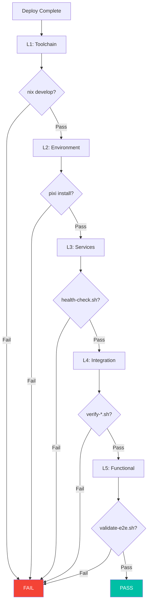

# Smoke Tests Module

**Layer:** L5 (Operations)
**Criticality:** HIGH
**Surface:** internal
**Runtime:** native, container
**Status:** verified
**Owner:** ripple-env maintainers

---

## Purpose

This module documents the smoke test strategy, verification scripts, and "definition of done" criteria for ripple-env deployments.

---

## Definition of Done

A deployment is considered **done** when all of the following pass:

### L0 - Foundation Checks

- [ ] Repository cloned successfully
- [ ] Git LFS files present
- [ ] File permissions correct

### L1 - Toolchain Checks

- [ ] Nix installed and functional
- [ ] Flakes enabled
- [ ] Pixi installed
- [ ] DevShell activates without errors

### L2 - Environment Checks

- [ ] Environment variables loaded
- [ ] Python version correct (3.11+)
- [ ] ROS2 sourced correctly
- [ ] Workspace builds

### L3 - Service Checks

- [ ] Docker networks created
- [ ] Core services running
- [ ] Health endpoints responding
- [ ] No critical errors in logs

### L4 - Integration Checks

- [ ] Services can communicate
- [ ] mTLS handshakes succeed (if enabled)
- [ ] Database connections work
- [ ] Message queues operational

### L5 - Functional Checks

- [ ] API endpoints respond correctly
- [ ] Auth flows complete
- [ ] Data can be written and read
- [ ] End-to-end test passes

---

## Smoke Test Scripts

### Master Validation

**Evidence:** `scripts/validate-e2e.sh`

```bash
# Run full end-to-end validation
./scripts/validate-e2e.sh
```

**Exit Codes:**
- 0: All tests passed
- 1: Some tests failed
- 2: Critical failure (infrastructure)

### Component Verification Scripts

**Evidence:** `scripts/verify-*.sh` (10 scripts)

| Script | Component | Check Type |
|--------|-----------|------------|
| `verify-argo-workflows.sh` | Argo Workflows | API health |
| `verify-edge.sh` | Edge gateway | Endpoint reachability |
| `verify-jetstream.sh` | NATS JetStream | Stream status |
| `verify-mindsdb.sh` | MindsDB | HTTP health |
| `verify-mtls-setup.sh` | mTLS | Certificate validation |
| `verify-observability.sh` | Observability stack | All endpoints |
| `verify-open-lovable.sh` | Open Lovable | UI health |
| `verify-qudag.sh` | QuDAG | Node connectivity |
| `verify-ruvector.sh` | RuVector | Vector DB health |
| `verify-state-storage.sh` | State storage | Redis, PostgreSQL |

### Configuration Validation

**Evidence:** `scripts/validate-*.sh`

| Script | Purpose | Checks |
|--------|---------|--------|
| `validate-configs.sh` | Config syntax | YAML, JSON, TOML |
| `validate-resources.sh` | Resource limits | Memory, CPU |
| `validate-manifest.py` | ARIA manifest | Schema validation |
| `validate-channels.py` | Pixi channels | Channel availability |

---

## Smoke Test Flow



---

## Health Check Script

**Evidence:** `scripts/health-check.sh`

```bash
#!/bin/bash
# Health check for all services

ENDPOINTS=(
    "LocalAI:http://localhost:8080/v1/models"
    "NATS:http://localhost:8222/healthz"
    "Temporal:http://localhost:7233/health"
    "Vault:http://localhost:8200/v1/sys/health"
    "Prometheus:http://localhost:9090/-/healthy"
    "Grafana:http://localhost:3000/api/health"
    "Loki:http://localhost:3100/ready"
    "Tempo:http://localhost:3200/ready"
)

for endpoint in "${ENDPOINTS[@]}"; do
    name="${endpoint%%:*}"
    url="${endpoint#*:}"
    if curl -sf "$url" > /dev/null 2>&1; then
        echo "[OK] $name"
    else
        echo "[FAIL] $name - $url"
    fi
done
```

---

## CI Integration

### E2E Validation Workflow

**Evidence:** `.github/workflows/e2e-validation.yml`

```yaml
name: E2E Validation
on:
  workflow_dispatch:
  schedule:
    - cron: '0 6 * * *'  # Daily at 6 AM

jobs:
  validate:
    runs-on: ubuntu-latest
    steps:
      - uses: actions/checkout@v4

      - name: Setup environment
        run: |
          ./bootstrap.sh --ci

      - name: Start services
        run: |
          docker compose -f docker/docker-compose.yml up -d
          sleep 30

      - name: Run smoke tests
        run: |
          ./scripts/health-check.sh
          ./scripts/validate-e2e.sh
```

### Component Verification Workflow

**Evidence:** `.github/workflows/component-verification.yml`

```yaml
name: Component Verification
on:
  workflow_dispatch:

jobs:
  verify:
    runs-on: ubuntu-latest
    strategy:
      matrix:
        component:
          - observability
          - jetstream
          - state-storage
    steps:
      - uses: actions/checkout@v4
      - name: Verify ${{ matrix.component }}
        run: ./scripts/verify-${{ matrix.component }}.sh
```

---

## Smoke Test Checklist

### Quick Smoke (5 minutes)

```bash
# 1. Enter dev shell
nix develop

# 2. Verify ROS2
ros2 --help

# 3. Verify pixi
pixi --version

# 4. Verify health
./scripts/health-check.sh
```

### Full Smoke (15 minutes)

```bash
# 1. Start all services
docker compose -f docker/docker-compose.yml up -d

# 2. Wait for startup
sleep 60

# 3. Run health check
./scripts/health-check.sh

# 4. Run component verification
for script in scripts/verify-*.sh; do
    echo "Running $script..."
    bash "$script" || echo "WARN: $script failed"
done

# 5. Run E2E validation
./scripts/validate-e2e.sh

# 6. Check logs for errors
docker compose logs 2>&1 | grep -i error
```

---

## Failure Troubleshooting

### Common Failures

| Failure | Cause | Resolution |
|---------|-------|------------|
| DevShell won't activate | Nix cache miss | Run `nix develop -L` |
| Service won't start | Port conflict | Check `docker ps` |
| Health check timeout | Service slow start | Increase wait time |
| mTLS failure | Certificate expired | Run `rotate-certs.sh` |
| Memory error | WSL limits | Update `.wslconfig` |

### Debug Commands

```bash
# Check service logs
docker compose logs <service> --tail 100

# Check resource usage
docker stats

# Check network connectivity
docker network ls
docker network inspect flexstack

# Check port bindings
docker compose ps
netstat -tlnp | grep <port>
```

---

## Success Criteria

| Level | Criteria | Required |
|-------|----------|----------|
| L1 | `nix develop` succeeds | Yes |
| L2 | `pixi install` succeeds | Yes |
| L3 | 80% of health checks pass | Yes |
| L4 | mTLS verification passes | No (dev) |
| L5 | E2E validation passes | No (dev) |

### Production Requirements

For production deployments, ALL levels must pass:
- L1-L5 checks: 100%
- Security scan: No critical vulnerabilities
- Performance: Latency < 100ms P95

---

## Related Docs

- [Bootstrap Module](bootstrap.md) - Environment setup
- [scripts/validate-e2e.sh.md](../scripts/validate-e2e.sh.md) - E2E script
- [scripts/health-check.sh.md](../scripts/health-check.sh.md) - Health check script
- [TROUBLESHOOTING.md](../TROUBLESHOOTING.md) - Problem solving
- [cookbooks/EMERGENCY_PROCEDURES.md](../cookbooks/EMERGENCY_PROCEDURES.md) - Incident response

---

**Last Updated:** 2026-01-14
