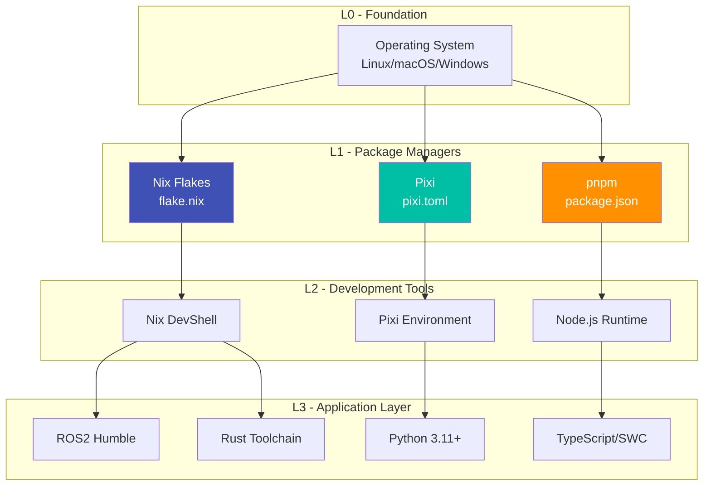

# Toolchain Module

**Layer:** L1 (Toolchain)
**Criticality:** HIGH
**Surface:** internal
**Runtime:** native
**Status:** verified
**Owner:** ripple-env maintainers

---

## Purpose

This module documents the development toolchain, package management systems, and version pinning strategies used in ripple-env.

---

## Package Management Stack

### Primary Systems

**Evidence:** `flake.nix`, `pixi.toml`, `package.json`

| System | Purpose | Lock File | Update Command |
|--------|---------|-----------|----------------|
| Nix Flakes | System packages, shells, images | `flake.lock` | `nix flake update` |
| Pixi | Python/Conda packages | `pixi.lock` | `pixi update` |
| npm/pnpm | JavaScript dependencies | `pnpm-lock.yaml` | `pnpm update` |
| Cargo | Rust dependencies | `Cargo.lock` | `cargo update` |

### Toolchain Diagram



---

## Nix Flake Configuration

### Inputs

**Evidence:** `flake.nix` lines 17-76

| Input | URL | Purpose |
|-------|-----|---------|
| `nixpkgs` | `github:nixos/nixpkgs/nixos-unstable` | Development packages |
| `nixpkgs-stable` | `github:nixos/nixpkgs/nixos-24.11` | Production packages |
| `flake-parts` | `github:hercules-ci/flake-parts` | Flake composition |
| `home-manager` | `github:nix-community/home-manager` | User configuration |
| `nixos-wsl` | `github:nix-community/NixOS-WSL` | WSL2 support |
| `agenix` | `github:ryantm/agenix` | Secrets management |
| `holochain-overlay` | `github:spartan-holochain-counsel/nix-overlay` | Holochain packages |

### Dual Channel Strategy

**Evidence:** `flake.nix`, `docs/CHANNEL-STRATEGY.md`

```
Production (nixos-24.11):
  - Stable, well-tested packages
  - NixOS image generation
  - Security-focused deployments

Development (nixos-unstable):
  - Latest packages
  - Day-to-day development
  - Feature exploration
```

### Binary Caches

**Evidence:** `flake.nix` nixConfig section

| Cache | URL | Purpose |
|-------|-----|---------|
| Official | `cache.nixos.org` | Default Nix cache |
| Community | `nix-community.cachix.org` | Community packages |
| CUDA | `cuda-maintainers.cachix.org` | CUDA packages |

---

## Pixi Configuration

### Channels

**Evidence:** `pixi.toml` channels section

| Channel | Priority | Purpose |
|---------|----------|---------|
| `robostack-humble` | 1 (highest) | ROS2 Humble packages |
| `conda-forge` | 2 | General packages |
| `pytorch` | 3 | PyTorch ecosystem |
| `nvidia` | 4 | NVIDIA CUDA tools |

### Python Version

**Evidence:** `pixi.toml` line 27

```toml
python = ">=3.11,<3.13"
```

**Rationale:**
- Python 3.11+ required for performance improvements
- Python 3.13 excluded due to compatibility issues with some ROS2 packages

### Feature Flags

**Evidence:** `pixi.toml` features section

| Feature | Packages | Platform Restriction |
|---------|----------|---------------------|
| `cuda` | `pytorch-cuda`, `cudatoolkit` | Linux only |
| `aios` | `cerebrum`, `aios-kernel` | All |
| `llmops` | `mlflow`, `trulens` | All |
| `finetuning` | `unsloth`, `accelerate` | All |
| `caching` | `redis-py`, `semantic-cache` | All |
| `docs` | `mkdocs-material`, `mike` | All |

---

## npm/pnpm Configuration

### Package Manager

**Evidence:** `package.json`

```json
{
  "packageManager": "pnpm@9.15.0"
}
```

### Key Dependencies

**Evidence:** `package.json` dependencies

| Package | Purpose |
|---------|---------|
| `@anthropic-ai/sdk` | Claude API integration |
| `@modelcontextprotocol/sdk` | MCP protocol |
| `@swc/core` | TypeScript compilation |

---

## Version Pinning Strategy

### Lock Files

**Evidence:** Repository root

| File | System | Commit Policy |
|------|--------|---------------|
| `flake.lock` | Nix | Always committed |
| `pixi.lock` | Pixi | Always committed |
| `pnpm-lock.yaml` | pnpm | Always committed |
| `Cargo.lock` | Cargo | Always committed |

### Update Schedule

**Evidence:** `docs/cookbooks/DEPENDENCY_UPDATES.md`

| Frequency | Action | Scope |
|-----------|--------|-------|
| Weekly | `pixi update` | Python packages |
| Weekly | `nix flake update` | Nix inputs |
| Monthly | Major version review | All systems |
| Quarterly | Security audit | All dependencies |

---

## Tool Versions

### Current Pinned Versions

**Evidence:** `flake.lock`, `pixi.lock`

| Tool | Version | Source |
|------|---------|--------|
| Nix | 2.24+ | Determinate Systems installer |
| Pixi | 0.40+ | Pixi installer |
| Python | 3.11.x/3.12.x | Pixi (conda-forge) |
| ROS2 Humble | 2024.x | Pixi (robostack-humble) |
| Node.js | 22.x | Nix |
| Rust | 1.83+ | Nix |

### Compatibility Matrix

**See:** [COMPATIBILITY_MATRIX.md](../COMPATIBILITY_MATRIX.md)

---

## Development Tools

### Editors

**Evidence:** `modules/common/editor/`

| Editor | Config Location | LSP Support |
|--------|-----------------|-------------|
| Neovim | `~/.config/nvim/` | Rust, Python, Nix, TypeScript |
| Helix | `~/.config/helix/` | Via home-manager |
| VS Code | `.vscode/` | Extensions recommended |

### Linters and Formatters

**Evidence:** `.pre-commit-config.yaml`

| Tool | Language | Config |
|------|----------|--------|
| `ruff` | Python | `pyproject.toml` |
| `nixfmt` | Nix | Built-in |
| `prettier` | JS/TS/JSON | `.prettierrc` |
| `shellcheck` | Shell | CI workflow |

---

## Nix Commands

### Core Commands

**Evidence:** `nix/commands/core.nix`

| Command | Alias | Purpose |
|---------|-------|---------|
| `colcon build --symlink-install` | `cb` | Build ROS2 packages |
| `colcon test` | `ct` | Run ROS2 tests |
| `colcon test-result` | `ctr` | View test results |
| `update-deps` | - | Update all dependencies |

### AI Commands

**Evidence:** `nix/commands/ai.nix`

| Command | Purpose |
|---------|---------|
| `localai` | Start LocalAI server |
| `agixt` | Start AGiXT server |
| `aios` | Start AIOS runtime |

### Infrastructure Commands

**Evidence:** `nix/commands/infra.nix`

| Command | Purpose |
|---------|---------|
| `ipfs-ctl` | IPFS node management |
| `nats-ctl` | NATS server control |
| `prom-ctl` | Prometheus management |

---

## Troubleshooting

### Common Issues

**Issue:** Nix evaluation too slow
**Solution:** See `docs/nix/NIX_EVALUATION_OPTIMIZATION.md`

**Issue:** Pixi solve fails
**Solution:**
```bash
pixi clean
rm pixi.lock
pixi install
```

**Issue:** npm packages conflict
**Solution:**
```bash
rm -rf node_modules pnpm-lock.yaml
pnpm install
```

---

## Related Docs

- [Bootstrap Module](bootstrap.md) - Initial setup
- [Environments Module](environments.md) - Environment configuration
- [COMPATIBILITY_MATRIX.md](../COMPATIBILITY_MATRIX.md) - Version compatibility
- [CONFLICTS.md](../CONFLICTS.md) - Dependency conflicts
- [cookbooks/DEPENDENCY_UPDATES.md](../cookbooks/DEPENDENCY_UPDATES.md) - Update procedures

---

**Last Updated:** 2026-01-14
