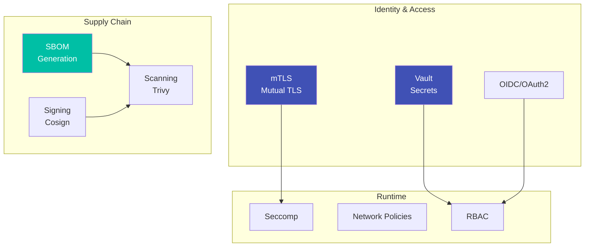

# Security

ripple-env implements security best practices including mTLS, secrets management, and supply chain security.

## Overview



## Quick Reference

```bash
# Generate SBOM
sbom-generate

# Run security audit
sbom-audit

# Initialize mTLS certificates
step-ca-init
```

## Documentation

<div class="grid cards" markdown>

-   :material-shield-lock:{ .lg .middle } __mTLS Configuration__

    ---

    Configure mutual TLS for service communication

    [:octicons-arrow-right-24: mTLS Guide](mtls.md)

-   :material-key:{ .lg .middle } __Secrets Management__

    ---

    Managing secrets with agenix and Vault

    [:octicons-arrow-right-24: Secrets Guide](secrets.md)

-   :material-package-variant-closed:{ .lg .middle } __Supply Chain Security__

    ---

    SBOM generation and vulnerability scanning

    [:octicons-arrow-right-24: Supply Chain](supply-chain.md)

</div>

## Security Checklist

- [ ] Enable mTLS for all service communication
- [ ] Store secrets in Vault or agenix
- [ ] Generate and verify SBOMs
- [ ] Enable network policies
- [ ] Configure RBAC for Kubernetes
- [ ] Run regular vulnerability scans
